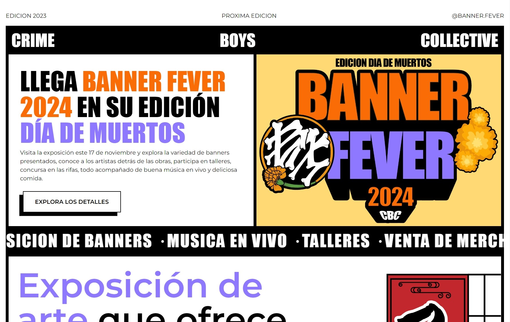

# **🚩 Banner Fever**

---

## 👨‍💻 About this project

Banner Fever is a banner exhibition, a traditional element of the tattoo. Each year a new edition is held, in which more than 60 artists from different disciplines participate.

This project aims to provide a web presence for the exhibition, since it is one of the only events of its kind and plans to make it known internationally.

For development I decided to use Astro, a technology that has been booming, which I have already used before, and which I would like to continue learning.

---

---
